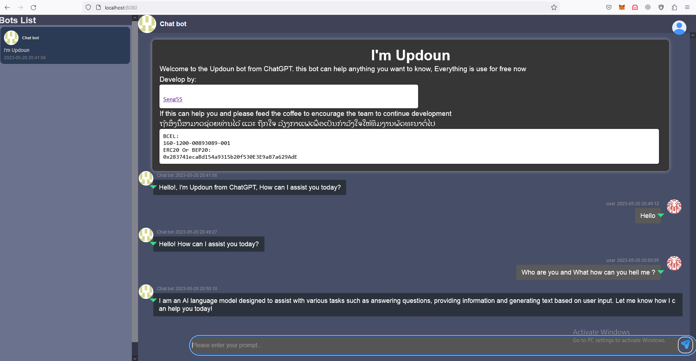

# ChatGPT-VUE-Chat abd SEVER
## Description
A simple chat interface with ChatGPT on the left and users on the right. When the 'Send' button is clicked, the prompt is sent to the backend API for processing.

You can choose who you talk to on the SideBar.

Here is example:



### Features
- Before chat formally, `client` load `client/public/bots.json` to initialize the bots, which make the model become different role. 

  -  The data in json is: 

  ```json
  ${name of the bot}:${its init prompt}
  ```

  -  you can get some init prompt from:
     -   https://github.com/f/awesome-chatgpt-prompts 
     -  https://github.com/PlexPt/awesome-chatgpt-prompts-zh

- Need your openai.api_key from "https://platform.openai.com/account/api-keys"

## Run

You'd better run `server` first.

### Server 
```shell
cd server
```
### Client
```shell
cd client
```
If you have better suggestions, please issue.
